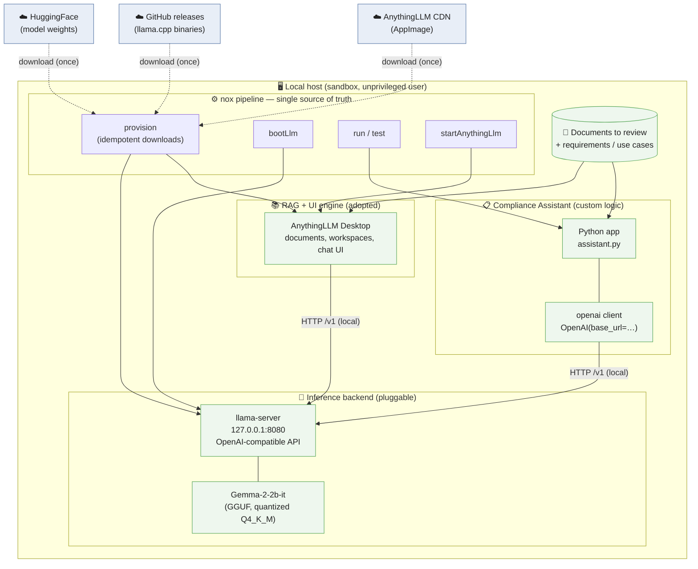
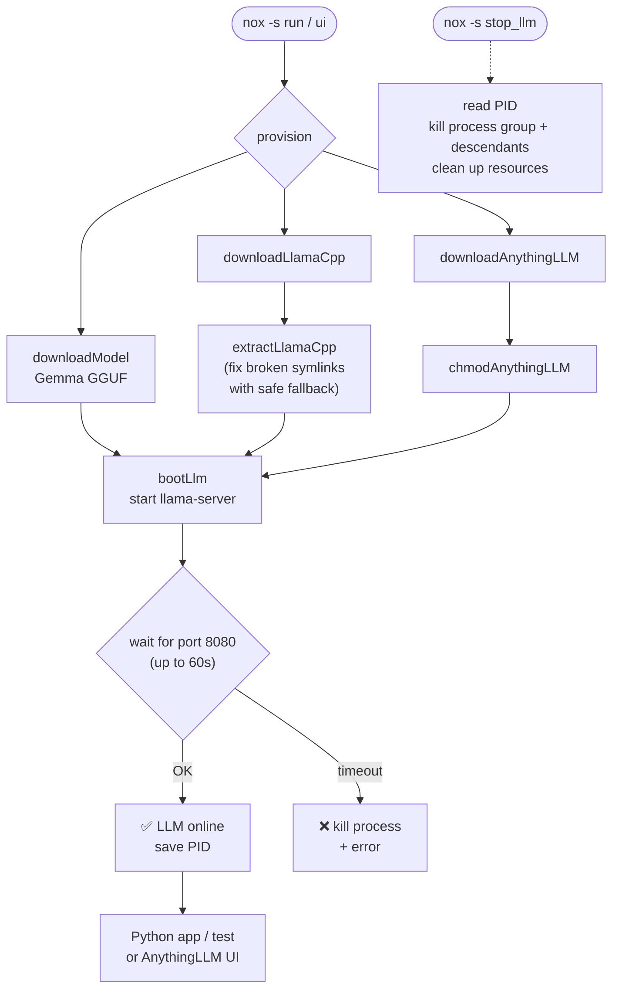
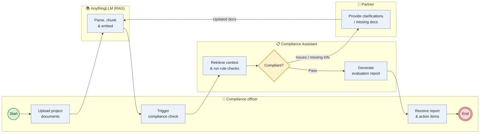
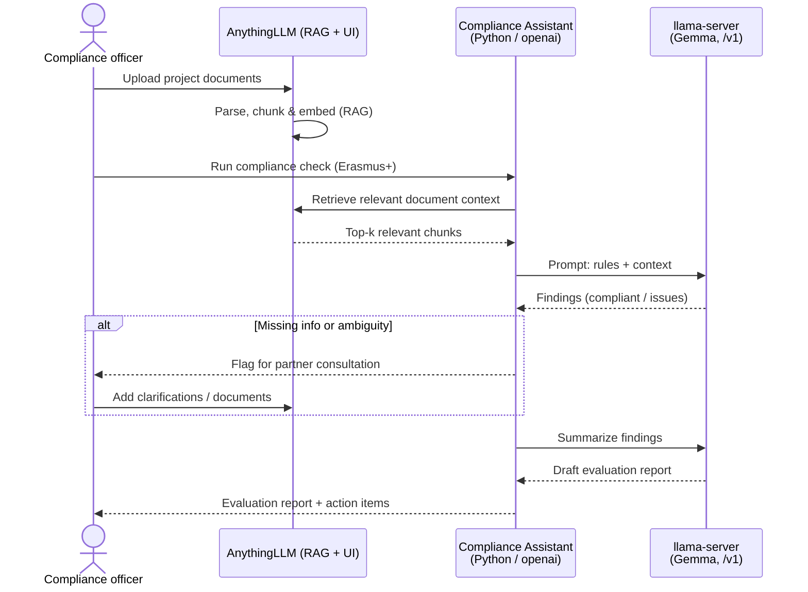

# Architecture — LocalCounsel

A local assistant for reviewing documents and checking compliance (e.g. Erasmus+).
The entire solution runs **locally** (GDPR), is **modular**, and uses a **pluggable LLM**.

## Table of contents

1. [Component overview](#1-component-overview)
2. [Provisioning & startup flow](#2-provisioning--startup-flow)
3. [Use case — compliance review workflow (BPMN-style)](#3-use-case--compliance-review-workflow-bpmn-style)
   - [3.1 Runtime interaction (sequence)](#31-runtime-interaction-sequence)
4. [Key architectural decisions](#4-key-architectural-decisions)
5. [LLM pluggability](#5-llm-pluggability)

## 1. Component overview

The solution consists of four layers: the automation pipeline (nox), the local
inference backend (llama.cpp + a pluggable GGUF model), the RAG/UI engine
(AnythingLLM), and the custom compliance business logic (Python / openai).

## 2. Provisioning & startup flow

The demo environment starts with a single command via the nox pipeline.
Downloads are idempotent — they run identically everywhere and only when an
artifact does not yet exist.

## 3. Use case — compliance review workflow (BPMN-style)

This is how the solution is actually used (Erasmus+ example), modelled as a
BPMN-style process: swimlanes per participant, a start/end event (circles), an
exclusive gateway (diamond) for the compliance decision, and a loop back to
ingestion when partners must clarify or supply missing documents.

> Note: Mermaid has no native BPMN diagram type, so this approximates BPMN
> notation (lanes = subgraphs, events = circles, gateway = diamond). For
> standards-true BPMN, export this flow to a `.bpmn` file via a tool such as
> [BPMN Sketch Miner](https://www.bpmn-sketch-miner.ai).

### 3.1 Runtime interaction (sequence)

How the components collaborate during a single compliance check.

## 4. Key architectural decisions

| Requirement | Decision (Build vs. Adopt) | Realization |
| --- | --- | --- |
| RAG + UI engine | **Adopt** — no custom chat UI | AnythingLLM Desktop |
| Intelligence engine (LLM) | **Adopt + pluggable** | llama.cpp + Gemma via OpenAI-compatible API |
| Compliance business logic | **Build** — custom integrations | Python + openai client |
| Automation / installation | **Build** — single source of truth | nox sessions (`provision`, `boot_llm`, `run`, `stop_llm`) |
| Privacy / GDPR | Everything runs locally | No data leaves host; sandbox, unprivileged user |

## 5. LLM pluggability

Both the custom Python app and the RAG engine access the model exclusively through
an **OpenAI-compatible HTTP interface** at `127.0.0.1:8080/v1`. The inference
backend or model can therefore be swapped (another GGUF, another server) without
changing any business logic — the interface stays the same.
