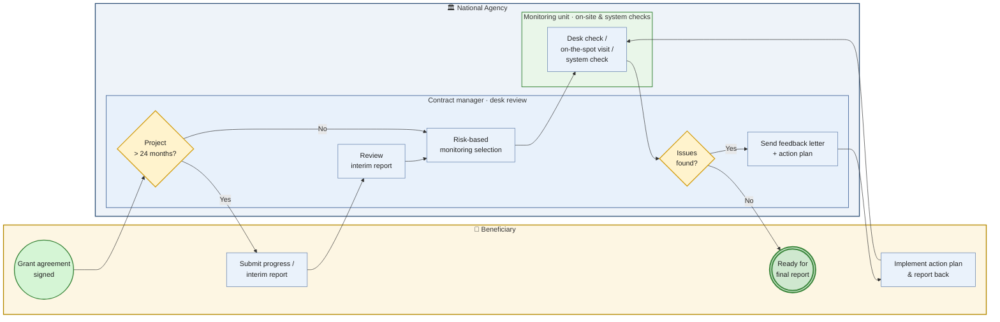
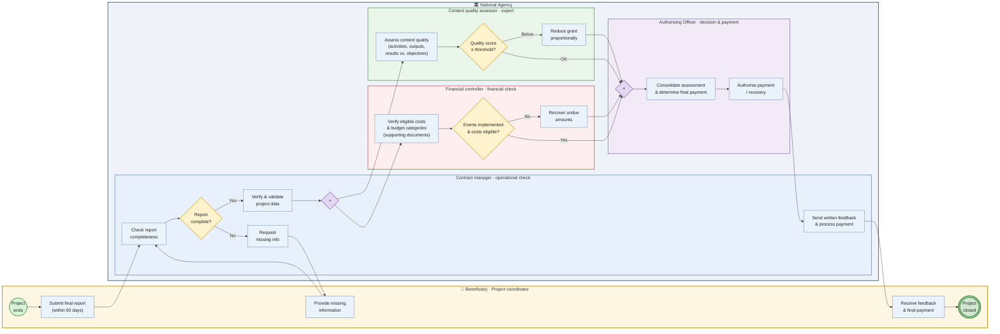

# Erasmus+ processes — BPMN-style diagrams

Process models for three Erasmus+ scenarios the Compliance Assistant supports:
**application evaluation**, **project monitoring**, and **final report evaluation**.
These are the official National Agency (NA) processes, simplified for modelling.

> Note: Mermaid has no native BPMN diagram type, so these approximate BPMN
> notation — swimlanes = subgraphs, events = circles (green start / red end),
> gateways = diamonds, activities = rectangles. For standards-true BPMN, export a
> flow to a `.bpmn` file via a tool such as
> [BPMN Sketch Miner](https://www.bpmn-sketch-miner.ai).

## Table of contents

1. [Application evaluation](#1-application-evaluation)
2. [Project monitoring](#2-project-monitoring)
3. [Final report evaluation](#3-final-report-evaluation)
4. [Sources](#4-sources)

---

## 1. Application evaluation

Applications are assessed by the National/Executive Agency strictly against the
Programme Guide criteria. The first three checks (admissibility, eligibility,
exclusion & selection) are **pass/fail gates** — failing any one stops the
evaluation and rejects the proposal. Only proposals passing all gates reach the
quality assessment by the evaluation committee and (independent) experts.

```mermaid
%%{init: {"themeVariables": {"fontSize": "16px"}}}%%
flowchart LR
    classDef event fill:#d5f5d5,stroke:#3c873c,stroke-width:2px,color:#222;
    classDef endev fill:#cfe8cf,stroke:#3c873c,stroke-width:3px,color:#222;
    classDef rejev fill:#f8d7da,stroke:#c0392b,stroke-width:3px,color:#222;
    classDef gw fill:#fff3cd,stroke:#d4a017,stroke-width:2px,color:#222;
    classDef task fill:#eaf2fb,stroke:#5b7aa8,color:#222;

    subgraph APP["🧑 Applicant"]
        direction TB
        START((Application<br/>submitted)):::event
    end

    subgraph NA["🏛️ National / Executive Agency"]
        direction TB
        subgraph PO["Project Officer · eligibility & selection"]
            direction LR
            ADM["Admissibility<br/>check"]:::task
            GADM{"Admissible?"}:::gw
            ELI["Eligibility<br/>check"]:::task
            GELI{"Eligible?"}:::gw
            EXC["Exclusion & selection<br/>(financial & operational<br/>capacity)"]:::task
            GEXC{"Pass?"}:::gw
        end
        subgraph EC["Evaluation committee & experts"]
            direction LR
            QA["Quality assessment<br/>vs. award criteria"]:::task
            RANK["Establish<br/>ranking list"]:::task
            GRANK{"Above threshold<br/>& within budget?"}:::gw
        end
        subgraph AW["Authorising Officer · award & contracting"]
            direction LR
            AWARD["Award decision<br/>& legal checks"]:::task
            GRANT["Sign grant<br/>agreement"]:::task
            ENDOK(((Grant<br/>awarded))):::endev
            REJECT(((Rejected))):::rejev
        end
    end

    START --> ADM --> GADM
    GADM -->|No| REJECT
    GADM -->|Yes| ELI --> GELI
    GELI -->|No| REJECT
    GELI -->|Yes| EXC --> GEXC
    GEXC -->|No| REJECT
    GEXC -->|Yes| QA --> RANK --> GRANK
    GRANK -->|No| REJECT
    GRANK -->|Yes| AWARD --> GRANT --> ENDOK

    style NA fill:#eef3f9,stroke:#34557a,stroke-width:2px
    style APP fill:#fdf6e3,stroke:#b58900,stroke-width:2px
    style PO fill:#e8f1fb,stroke:#5b7aa8,stroke-width:1.5px
    style EC fill:#f1ebf8,stroke:#7d5ba6,stroke-width:1.5px
    style AW fill:#e9f6e9,stroke:#3c873c,stroke-width:1.5px
```

---

## 2. Project monitoring

During implementation the NA monitors the project. Projects longer than 24 months
must submit a **progress/interim report** (usually at the midpoint). The NA applies
risk-based monitoring (desk checks, on-the-spot visits, system checks). When issues
are found, the NA sends a feedback letter with an action plan that the beneficiary
must implement and report back on — looping until resolved.

---

## 3. Final report evaluation

Within 60 days of the project end the beneficiary submits the **final report**. The
NA is modelled as a pool with role lanes; the **contract manager** first checks
completeness and validates the reported data, then two reviews run **in parallel**
(modelled with BPMN parallel gateways `+`):

- **Content / substantive review** — a content quality assessor (expert) scores the
  quality of activities, outputs and results against the objectives.
- **Financial review** — a **financial controller** verifies eligible costs, budget
  categories and supporting documents to establish the approved costs.

The **final payment depends on the quality score and approved costs**: a low quality
score reduces the grant proportionally, and unimplemented events or ineligible costs
trigger recovery of undue amounts. An authorising officer consolidates both reviews
and authorises payment or recovery.

These are exactly the roles the Compliance Assistant supports: the **contract
manager** (operational/desk review across all three processes) and the **financial
controller** (financial verification, eligible-cost and budget-category checks).

See [final-report-llm-eu-ai-act.md](final-report-llm-eu-ai-act.md) for which stages a
local LLM can assist with and the EU AI Act constraints that apply to each.

---

## 4. Sources

- [What happens once the application is submitted? — Erasmus+ Programme Guide, Part C](https://erasmus-plus.ec.europa.eu/programme-guide/part-c/what-happens-submission)
- [Step 2: Check the compliance with the programme criteria — Erasmus+](https://erasmus-plus.ec.europa.eu/programme-guide/part-c/compliance)
- [What happens when the application is approved? — Erasmus+](https://erasmus-plus.ec.europa.eu/programme-guide/part-c/what-happen-approved)
- [Erasmus+ Programme Guide 2026 (PDF)](https://erasmus-plus.ec.europa.eu/sites/default/files/2025-11/programme-guide-2026_en.pdf)
- [2024 Erasmus+ Guide for Experts on Quality Assessment (PDF)](https://www.erasmusplus.it/wp-content/uploads/2024/02/IV.1a-EGuide-for-experts-on-quality-assessment_2024_v2.pdf)
- [How to complete and submit the final beneficiary report — EC Public Wiki](https://wikis.ec.europa.eu/display/NAITDOC/How+to+complete+and+submit+the+final+beneficiary+report)
- [Reporting requirements for Erasmus+ funded projects — Euneos](https://www.euneoscourses.eu/what-are-the-reporting-requirements-for-erasmus-funded-projects/)
- [Instructions for the implementation of Erasmus+ projects 2021-2027 — Finnish NA (OPH)](https://www.oph.fi/en/programmes/instructions-implementation-erasmus-projects-2021-2027)
