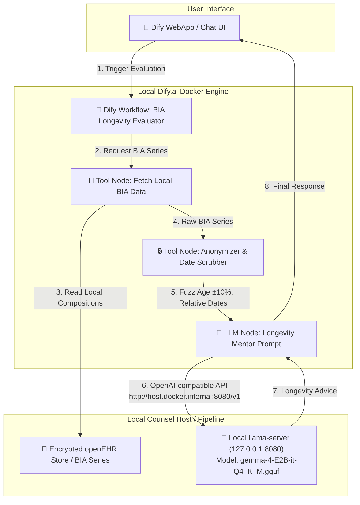

# TODO & Requirements: Dify.ai + Local Gemma BIA Evaluation Flow

## 1. Executive Summary & Objective

Currently, the end-to-end BIA body composition evaluation flow (`tests/test_nutrition_advice_e2e.py` and `local_counsel.health_sync.nutrition`) invokes our local **Gemma LLM server** (`http://127.0.0.1:8080/v1`) directly via Python HTTP calls.

To achieve the full architecture outlined in [health-integration-architecture.md](./health-integration-architecture.md) (§6 & §7), this flow must be orchestrated by **[Dify.ai](https://dify.ai)** running locally, utilizing our local **Gemma model (`gemma-4-E2B-it-Q4_K_M.gguf`)** via Dify's OpenAI-compatible model provider interface.

---

## 2. Target Architecture Diagram

---

## 3. Core Functional & Technical Requirements

### REQ-1: Container-to-Host LLM Networking
- **Requirement**: Dify containers (`docker-compose.yaml` in `build/dify/docker`) must reach the host running `llama-server` on port `8080`.
- **Specification**:
  - Configure `host.docker.internal:8080` or explicit bridge gateway IP in Dify's environment.
  - Ensure `llama-server` is started with `--host 0.0.0.0` or bound to the docker bridge interface so Dify can invoke `/v1/chat/completions`.

### REQ-2: Dify Model Provider Configuration (Local Gemma)
- **Requirement**: Register our local `llama-server` as an **OpenAI-API-compatible** LLM provider in Dify.
- **Specification**:
  - Provider Name: `OpenAI-API-compatible` / `Local-Gemma`
  - Server URL: `http://host.docker.internal:8080/v1`
  - Model Name: `gemma-4-E2B-it-Q4_K_M.gguf` (matching `LC_MODEL_NAME`)
  - Context Window: `8192`+ tokens (Gemma 4 supports far larger; bounded by llama-server --ctx-size)
  - API Key: `local-no-key-required` (or `sk-local`)

### REQ-3: Dify Custom Tool / API Service for BIA Data & Anonymization
- **Requirement**: Dify workflows require a mechanism to fetch user BIA measurements and apply local anonymization before LLM invocation.
- **Specification**:
  - **Option A (REST Microservice Tool)**: Expose a local loopback HTTP endpoint (`http://127.0.0.1:8088/api/bia/anonymized_series`) from `local_counsel` that returns the pre-anonymized payload (`build_nutrition_prompt`).
  - **Option B (Dify Code Node / OpenAPI Plugin)**: Create a Dify Custom Tool (`openapi.yaml`) definition that Dify calls to obtain the monthly fluctuation table (`weight_kg`, `body_fat_%`, `hydration_%`, `muscle_kg`) with relative timestamps (`-6 mo`, ..., `current`) and fuzzed demographic band (`~36-48`).

### REQ-4: Dify Workflow DSL Blueprint (`.yml`)
- **Requirement**: Version-control the exact Dify Workflow definition as a YAML DSL blueprint in the repository (`workflows/bia_longevity_evaluator.yml`).
- **Specification**:
  - System Prompt: Encapsulate the Longevity Mentor persona & medical disclaimer.
  - Input Variables: `subject_profile_fuzzed`, `bia_fluctuation_table`, `user_question`.
  - Output: Markdown-formatted educational nutrition advisory.

### REQ-5: Ingestion from a **real** Google Health / Beurer Takeout export (deferred)
> Verified against an actual export (`private/…zip`, git-ignored). The current mock
> (`fetch_raw_dataset`, Google Fit `datasets.get` JSON, `com.google.body.*`) does
> **not** match reality. A real ingestion path must parse:
- **Format**: a Takeout ZIP under `Takeout/Google Health/…` — CSV, not Fit JSON.
  - `Physical Activity_GoogleData/weight.csv` → columns `timestamp, weight grams, data source` (weight in **grams**; many readings/day).
  - `Physical Activity_GoogleData/body_fat_YYYY-MM-01.csv` (monthly) → `timestamp, body fat percentage, data source`.
  - `Global Export Data/weight-*.json` → legacy Fitbit log with `weight` (**pounds**) + `bmi`.
- **Beurer provenance**: Beurer scale data arrives via its **HealthManager Pro** app
  through Android **Health Connect** — identified only by the `data source` value
  **`HealthManager Pro Health Connect`** (there is no literal "Beurer" token, and the
  scale is absent from `Paired Devices/Scales.csv`). Key on the `data source` column.
- **Sparse fields**: real export has only **weight + body-fat % (+ legacy BMI)** — no
  skeletal muscle, body water, bone mass, BMR, or visceral fat. The extra
  `BiaMeasurement` fields must become **Optional** (confirms gap 3.2 of `TODO.md`).
- **Requirements**: deterministic CSV parser (per-file unit conversion grams/lb→kg;
  key on `data source`); deterministic **aggregation** (e.g. daily/monthly median) →
  idempotent UUIDv5 openEHR upsert; **download link → encrypted-at-rest ZIP** beside
  `openehr.db` under the same DEK, with the download **mocked in tests**; a **human
  review gate** before any frontier egress. Test against a small **synthetic** fixture
  mirroring this schema — never the real private export.

---

## 4. Actionable Implementation Backlog (TODO)

### Phase 1: Local Networking & Server Provisioning
- [ ] **TASK-1.1**: Update `pipeline/server.py` to support binding `llama-server` to host IP `0.0.0.0` (or Docker bridge IP) when Dify orchestration mode is enabled (`LC_SERVER_HOST`).
- [ ] **TASK-1.2**: Update `pipeline/provisioning.py` and `noxfile.py` (`nox -s boot-dify`) to verify Dify container status and check network connectivity between `dify-api` container and `http://host.docker.internal:8080/health`.

### Phase 2: Dify Model Provider Automated Initialization
- [ ] **TASK-2.1**: Write a provisioning script (`pipeline/setup_dify_provider.py`) that uses Dify's internal setup REST API / database setup to auto-register `Local-Gemma` (`host.docker.internal:8080/v1`) as the default OpenAI-compatible LLM.
- [ ] **TASK-2.2**: Verify model completion calls from within a running Dify container via `curl -X POST http://host.docker.internal:8080/v1/chat/completions`.

### Phase 3: BIA Anonymization Custom Tool Integration
- [x] **TASK-3.1**: Create `src/local_counsel/health_sync/dify_tool_server.py` exposing a minimal FastAPI/HTTP endpoint:
  - `GET /v1/bia/summary`: Reads local BIA series, applies `SubjectProfile` fuzzing (±10% age) and relative dates (`-6 mo` .. `current`), and returns clean JSON.
- [x] **TASK-3.2**: Create the Dify OpenAPI tool manifest (`docs/longevity-coach/dify_bia_tool_openapi.yaml`) for importing into Dify Custom Tools.

### Phase 4: Workflow Blueprint & End-to-End Testing
- [x] **TASK-4.1**: Author and export `workflows/bia_longevity_evaluator.yml` containing the complete Dify Workflow definition utilizing `Local-Gemma`.
- [x] **TASK-4.2**: Implement `tests/test_dify_bia_flow_e2e.py` to execute a Dify workflow run via Dify's `/v1/workflows/run` API and assert that:
  - The workflow executes successfully against local Gemma.
  - Zero raw PII or exact calendar dates are transmitted.
  - The model returns structured educational guidance.

---

## 5. Verification Criteria
1. `nox -s test-dify-e2e` boots `llama-server` + Dify containers locally.
2. Dify executes the BIA Longevity Evaluator workflow entirely on `127.0.0.1` without external cloud API keys.
3. Output matches or exceeds the educational quality of the standalone Python implementation while providing Dify's UI, audit logs, and workflow tracing.
