# BIA End-to-End Flow

This process model documents the BIA (bioelectrical impedance analysis) example
end-to-end test, [`tests/test_nutrition_advice_e2e.py`](/tests/test_nutrition_advice_e2e.py).
It shows how 12 months of mocked Google Health body-composition data flow through
mapping, **encrypted local persistence**, and analysis before an anonymized query
reaches the external AI. The lanes correspond to the real modules that run.

---

## Process diagram (BPMN-style)

> Note: Mermaid has no native BPMN diagram type, so this approximates BPMN
> notation — swimlanes = subgraphs, events = circles (green start / green end /
> red abort), gateways = yellow diamonds, activities = blue rectangles, and the
> encrypted store = a purple cylinder. For standards-true BPMN, export the flow to
> a `.bpmn` file via a tool such as
> [BPMN Sketch Miner](https://www.bpmn-sketch-miner.ai).

```mermaid
%%{init: {"themeVariables": {"fontSize": "16px"}}}%%
flowchart LR
    classDef event fill:#d5f5d5,stroke:#3c873c,stroke-width:2px,color:#222;
    classDef endev fill:#cfe8cf,stroke:#3c873c,stroke-width:3px,color:#222;
    classDef rejev fill:#f8d7da,stroke:#c0392b,stroke-width:3px,color:#222;
    classDef gw fill:#fff3cd,stroke:#d4a017,stroke-width:2px,color:#222;
    classDef task fill:#eaf2fb,stroke:#5b7aa8,color:#222;
    classDef store fill:#ece3f7,stroke:#7d5ba6,stroke-width:2px,color:#222;

    subgraph TRIG["🔐 Retrieval Trigger · health_sync.sync"]
        direction TB
        START((BIA sync<br/>triggered)):::event
        G1{"Passphrase<br/>valid?"}:::gw
        UNLOCK["Derive KEK (scrypt)<br/>& unwrap DEK"]:::task
        DECKEY["Decrypt Google Health<br/>API key (same DEK)"]:::task
        GK{"Credential<br/>present?"}:::gw
        DENIED(((Access<br/>denied))):::rejev
        NOCRED(((Aborted ·<br/>no credential))):::rejev
    end

    subgraph GH["☁️ Google Health · external / mocked"]
        direction TB
        FETCH["Fetch 12 months of BIA<br/>using decrypted API key"]:::task
    end

    subgraph MAP["🔄 Mapper · openehr.mapper"]
        direction TB
        TOCOMP["Map reading →<br/>openEHR Composition"]:::task
        UID["Derive deterministic<br/>UUIDv5 (idempotency key)"]:::task
        G2{"UID already<br/>stored?"}:::gw
    end

    subgraph REPO["🗄️ Encrypted openEHR Repository · openehr.store"]
        direction TB
        ENCRYPT["Encrypt AES-256-GCM<br/>(UID as AAD)"]:::task
        DB[("Per-user encrypted SQLite<br/>openehr.db")]:::store
        READBACK["Reopen · decrypt ·<br/>read compositions"]:::task
        RECON["Reconstruct<br/>BiaMeasurement series"]:::task
    end

    subgraph ANALYSIS["📊 Analysis · health_sync.nutrition"]
        direction TB
        FLUX["Summarize weight / fat /<br/>hydration / muscle fluctuations"]:::task
        PROMPT["Build anonymized prompt<br/>(offsets, sex, fuzzed age)"]:::task
    end

    subgraph AI["🧠 External AI · pluggable model"]
        direction TB
        ADVISE["Request educational<br/>nutrition guidance"]:::task
        DONE(((Advice<br/>returned))):::endev
    end

    START --> G1
    G1 -->|No · wrong user / stolen file| DENIED
    G1 -->|Yes| UNLOCK --> DECKEY --> GK
    GK -->|No| NOCRED
    GK -->|Yes| FETCH --> TOCOMP --> UID --> G2
    G2 -->|Yes · re-sync| DB
    G2 -->|No| ENCRYPT --> DB
    DB --> READBACK --> RECON --> FLUX --> PROMPT --> ADVISE --> DONE

    style TRIG fill:#f1ebf8,stroke:#7d5ba6,stroke-width:2px
    style GH fill:#fdf6e3,stroke:#b58900,stroke-width:2px
    style MAP fill:#e8f1fb,stroke:#5b7aa8,stroke-width:1.5px
    style REPO fill:#e9f6e9,stroke:#3c873c,stroke-width:1.5px
    style ANALYSIS fill:#eef3f9,stroke:#34557a,stroke-width:1.5px
    style AI fill:#fdeef0,stroke:#c0392b,stroke-width:1.5px
```

> **Passphrase gateway at the trigger.** Because the Google Health API key is
> stored **encrypted under the same data key** as the clinical records, retrieval
> cannot begin until the store is unlocked. A wrong passphrase (a different user,
> or a stolen file) fails to unwrap the data key and the run aborts *before* any
> credential is decrypted or any data is fetched.

---

## Stage narrative

| # | Lane | Action | Module |
| --- | --- | --- | --- |
| 1 | Trigger | Unlock the store: derive the KEK with scrypt, unwrap the data key (**passphrase gateway**) | `health_sync.sync.trigger_bia_sync` → `openehr.store.open` |
| 2 | Trigger | Decrypt the Google Health API key from the store (same data key) | `openehr.store.get_secret` |
| 3 | Google Health | Retrieve 12 monthly BIA readings using the decrypted key (mock, no network) | `health_sync.mock_google` |
| 4 | Mapper | Translate each reading into an openEHR composition | `openehr.mapper.bia_to_composition` |
| 5 | Mapper | Derive a deterministic UUIDv5 per reading (the idempotency key) | `openehr.mapper.composition_uid` |
| 6 | Repository | Encrypt each composition (AES-256-GCM, UID bound as AAD) and persist | `openehr.store.put_composition` |
| 7 | Repository | Reopen, decrypt, and read the compositions back (store is the source of truth) | `openehr.store.all_compositions` |
| 8 | Repository | Reconstruct the `BiaMeasurement` series from stored data | `openehr.mapper.composition_to_measurement` |
| 9 | Analysis | Summarize weight / body-fat / hydration / muscle fluctuations | `health_sync.nutrition.summarize_fluctuations` |
| 10 | Analysis | Render the anonymized prompt (relative month offsets, no dates/PII) | `health_sync.nutrition.build_nutrition_prompt` |
| 11 | External AI | Ask for educational nutrition advice on the fluctuations | `health_sync.nutrition.ask_nutrition_advice` |

## Gateways (decisions)

* **Passphrase valid? (at the retrieval trigger)** — The very first step of a sync
  run derives the KEK from the passphrase and must unwrap the data key. A wrong
  passphrase (different user, or a stolen file opened by an attacker) fails the GCM
  authentication tag and the run **aborts before any credential is decrypted or any
  BIA data is fetched**.
* **Credential present?** — After unlocking, the Google Health API key must exist in
  the store (it too is encrypted under the same key). If absent, the run aborts with
  `MissingCredentialError` — no anonymous retrieval is attempted.
* **UID already stored?** — Because the UID is a deterministic UUIDv5, re-syncing
  the same reading is an idempotent `PUT` (`INSERT OR REPLACE`); repeated runs do
  not duplicate records.

## Security & privacy properties exercised by the test

* **Encrypted at rest** — the raw `openehr.db` bytes contain no plaintext clinical
  values, archetype names, or magnitudes (asserted directly in the test).
* **Encrypted credentials** — the Google Health API key is stored under the *same*
  data key; the raw file contains no plaintext token, and unlocking is required to
  retrieve it (asserted directly in the test).
* **Per-user isolation** — each user has a separate database file; there is no
  multi-tenant table sharing.
* **Anonymized egress** — the only data that can leave the machine (the AI prompt)
  carries relative month offsets, biometric numbers, sex, and a **single randomized
  ±10% fuzzed age** — never dates, the exact age, or other PII.

See [Architecture — Google Health to openEHR Sync](/docs/longevity-coach/health-integration-architecture.md)
for the broader system design and the storage/encryption rationale.
